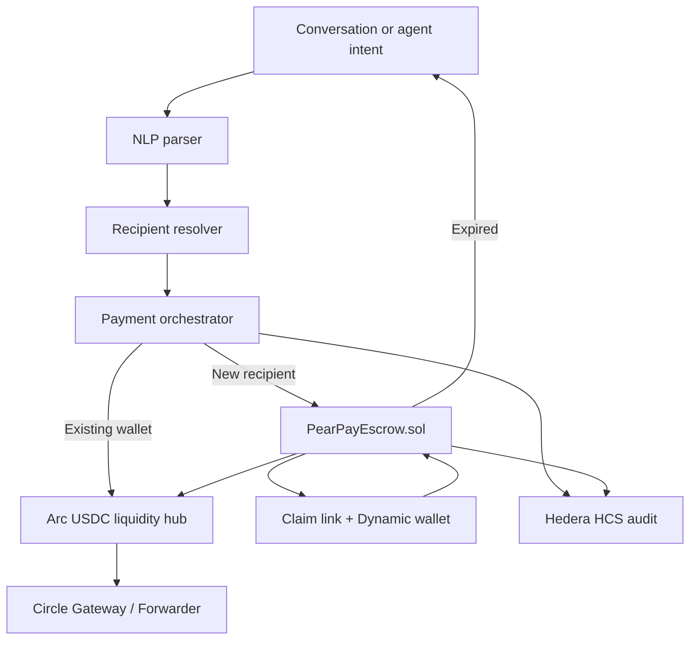

# 🍐 Pear Pay

## iMessage Apple Pay extension for Web3 Peer-to-Peer Messaging Payments Turn Conversations Into Transactions

### The Universal Payment Layer for Messaging, Social Apps, and AI Agents

### EthGlobal NYC 2026

**Live demo:** [https://pearpay.app/](https://pearpay.app/)

---

# Table of Contents

* [Executive Summary](#executive-summary)
* [Live Demo](#live-demo)
* [The Problem](#the-problem)
* [The Solution](#the-solution)
* [Supported Platforms](#supported-platforms)
* [Key Features](#key-features)
* [Claimable Payments](#claimable-payments)
* [Universal Recipient Resolution](#universal-recipient-resolution)
* [Claimable Payment Flow](#claimable-payment-flow)
* [Smart Escrow System](#smart-escrow-system)
* [Why This Matters](#why-this-matters)
* [Updated User Journey](#updated-user-journey)
* [Technical Architecture](#technical-architecture)
* [Arc Bounty Architecture](#arc-bounty-architecture)
* [Twilio Notification and Delivery Layer](#twilio-notification-and-delivery-layer)
* [Updated Architecture](#updated-architecture)
* [Hackathon Story](#hackathon-story)
* [Tech Stack](#tech-stack)
* [Why Now](#why-now)
* [Future Vision](#future-vision)
* [ETHGlobal Prize Strategy](#ethglobal-prize-strategy)
* [Tagline](#tagline)

---

# Executive Summary

Pear Pay is a conversational payment protocol that enables users to send money anywhere they communicate.

Whether users are chatting in Telegram, WhatsApp, Discord, iMessage, Slack, X, Instagram, or interacting with AI agents, Pear Pay transforms natural language into secure, private, and chain-abstracted blockchain transactions.

Instead of requiring users to understand wallets, chains, bridges, swaps, gas fees, and cryptographic addresses, Pear Pay allows them to simply express intent:

> "Send Molly $20"

> "Pay Alex back for dinner"

> "Split the Airbnb with everyone"

> "Send Sarah 50 USDC privately"

Pear Pay automatically handles everything else.

Behind the scenes, the platform resolves identities, creates wallets, routes transactions across chains, settles in USDC, and optionally protects transaction privacy.

Our vision is to become the payment infrastructure layer for both human communication and the emerging Agentic Economy.

---

# Live Demo

Pear Pay is deployed at **[https://pearpay.app/](https://pearpay.app/)**.

| Page | URL |
|------|-----|
| Home | https://pearpay.app/ |
| Try it (real Base Sepolia USDC) | https://pearpay.app/pay |
| Simulator (six messaging apps) | https://pearpay.app/messages |
| Prizes / bounty evidence | https://pearpay.app/prizes |

---

# The Problem

Despite significant advances in blockchain technology, sending crypto remains difficult for mainstream users.

Today's typical payment flow requires users to:

* Create a wallet
* Secure a seed phrase
* Understand networks
* Choose a chain
* Acquire gas tokens
* Copy wallet addresses
* Bridge assets
* Swap tokens
* Confirm transactions

The process is confusing, error-prone, and fundamentally different from the simple payment experiences consumers expect from Apple Pay, Venmo, Cash App, or Zelle.

At the same time, AI agents are beginning to transact autonomously, but there is no universal payment infrastructure designed for conversational commerce between humans and machines.

---

# The Solution

Pear Pay introduces a new payment paradigm:

## Conversational Commerce

Instead of navigating financial infrastructure, users simply communicate their intent.

Examples:

### Telegram

"Send Molly $20"

### Discord

"/pay @molly 20"

### WhatsApp

"Pay Alex back for dinner"

### Slack

"Split lunch with the engineering team"

### X Direct Message

"Send 50 USDC to @molly"

### AI Agent

"Pay OpenAI $0.05 for this API request"

Pear Pay transforms these messages into executable payment workflows.

---

# Supported Platforms

Pear Pay is designed to operate wherever people communicate.

## Messaging Platforms

* Telegram
* WhatsApp
* Discord
* iMessage
* Slack
* Signal
* Microsoft Teams

## Social Networks

* X
* Farcaster
* Lens
* Instagram
* TikTok

## AI Ecosystems

* ChatGPT Agents
* Claude Agents
* IDE and coding agents
* AutoGPT
* Custom Autonomous Agents

The goal is simple:

If you can send a message, you can send money.

---

# Key Features

## Natural Language Payments

Users communicate what they want to do using everyday language.

No addresses.

No chain selection.

No blockchain expertise required.

---

## Chain Abstraction

Pear Pay eliminates blockchain fragmentation.

Users never need to know:

* Which chain they are using
* Which token they hold
* Whether bridging is required
* How liquidity is sourced

The platform automatically routes and executes the optimal transaction path.

---

## Stablecoin Settlement

Every transaction ultimately settles in USDC.

Benefits include:

* Stable purchasing power
* Fast settlement
* Reduced volatility
* Global accessibility

---

## Private Transactions

Users may choose private transfer modes that protect:

* Wallet balances
* Transfer amounts
* Counterparty relationships
* Transaction history

Privacy becomes a built-in feature rather than a premium service.

---

## Human Readable Identity

Instead of using wallet addresses:

0x4E2B5C...

Users transact with recognizable identities:

* molly.eth
* alex.eth
* pearpay-agent.eth

This dramatically improves trust and usability.

---

## AI Agent Commerce

Pear Pay extends beyond human payments.

AI agents can:

* Purchase APIs
* Buy compute resources
* Pay for data access
* Coordinate with other agents
* Execute autonomous transactions

The same infrastructure that powers consumer payments can power machine-to-machine commerce.

---

# Claimable Payments

One of the biggest barriers to crypto adoption is requiring both the sender and recipient to already have wallets, accounts, and blockchain knowledge before money can move.

Pear Pay removes this requirement.

Users can send money to anyone, regardless of whether they already use Pear Pay, have a wallet, or even know what cryptocurrency is.

The sender's payment is never blocked by recipient onboarding.

Instead, Pear Pay creates a secure claimable payment.

Examples:

* Telegram username
* Discord username
* Phone number
* Email address
* ENS name
* Social handle
* AI agent identity

The recipient receives a payment notification and can claim the funds whenever they are ready.

This creates a dramatically simpler user experience and mirrors the behavior users already expect from services like Venmo, PayPal, Cash App, and Apple Cash.

---

# Universal Recipient Resolution

Pear Pay supports multiple recipient types.

## Existing Pear Pay User

If the recipient already has a Pear Pay wallet:

* Funds settle immediately
* No action required
* Recipient receives an instant notification

## Existing Wallet User

If the recipient has a discoverable wallet:

* ENS resolution occurs automatically
* Funds are delivered directly

## New User

If the recipient has never used Pear Pay:

* A claimable payment is created
* Funds are escrowed securely
* Recipient receives an invitation link
* Recipient creates a wallet when ready
* Funds are released automatically

No blockchain knowledge is required.

---

# Claimable Payment Flow

1. Molly sends $50 to Alex via Telegram
2. Alex does not have Pear Pay installed
3. Pear Pay creates a claimable payment
4. Funds are escrowed in USDC
5. Alex receives a secure claim link
6. Alex creates an embedded wallet through Dynamic
7. Identity verification occurs
8. Funds are released instantly

The original payment succeeds immediately from Molly's perspective.

No additional action is required.

---

# Smart Escrow System

Claimable payments are protected by programmable escrow contracts.

Features include:

* Time-based expiration
* Automatic refunds
* Recipient verification
* Transfer cancellation before claim
* Cross-chain settlement
* Private claims via Unlink

This ensures funds remain secure while preserving a frictionless user experience.

---

# Why This Matters

The best payment products allow users to pay people, not wallets.

Users think about:

* Friends
* Family
* Coworkers
* Creators
* Businesses

They do not think about:

* Blockchain addresses
* Networks
* Gas fees
* Wallet providers

Pear Pay focuses on human relationships and communication channels rather than blockchain infrastructure.

This dramatically lowers the barrier to adoption and enables payments to flow naturally through existing conversations.

---

# Updated User Journey

Sarah is chatting with friends in Telegram while planning a weekend trip.

One friend pays for the Airbnb.

Sarah types:

> "Pay Alex $125 for the Airbnb"

Pear Pay automatically:

1. Identifies Alex
2. Checks for an existing wallet
3. Creates a claimable payment if needed
4. Routes USDC through Arc as the liquidity hub
5. Settles funds in USDC and writes an HCS audit receipt
6. Protects transaction privacy through Unlink
7. Sends Alex a claim notification

If Alex already has Pear Pay, funds arrive instantly.

If Alex is new, the funds wait securely until he claims them.

The payment never fails because the recipient has not yet onboarded.

---

# Technical Architecture

## Dynamic

Dynamic provides:

* Embedded wallets
* Social authentication
* Agent wallets
* Server wallets

Users can begin using Pear Pay without managing seed phrases.

---

## ENS

ENS provides:

* Human-readable identities
* Agent identities
* Recipient discovery
* Address resolution

---

## Hedera

Hedera is Pear Pay's primary settlement rail.

Capabilities include:

* HTS — settle in USDC issued natively on Hedera, with HBAR for fees
* HCS — tamper-proof, ordered audit receipts for every payment and claim
* Smart Contract Service — PearPayEscrow.sol runs on Hedera's EVM
* Sub-cent fees and 3-5s finality, ideal for conversational and nano payments

Complex blockchain operations become a single user action settled on the
optimal rail.

---

## Arc

Arc serves as Pear Pay's default USDC settlement and liquidity hub.

Responsibilities:

* USDC settlement on Arc mainnet/testnet using
  `0x3600000000000000000000000000000000000000`
* Arc Testnet EURC support via
  `0x89B50855Aa3bE2F677cD6303Cec089B5F319D72a`
* Chain abstraction: Pear Pay detects the source chain and routes to Arc
* Claimable payments: escrow on send, release on claim, refund after expiry
* Circle Gateway / Forwarder path for source-to-Arc conditional transfers

---

## Unlink

Unlink provides privacy infrastructure.

Capabilities:

* Private balances
* Private transfers
* Confidential transaction routing

---

## Twilio

Twilio powers the recipient discovery and claim delivery layer.

Capabilities:

* SMS claim links
* WhatsApp Business messaging
* Phone verification via Twilio Verify
* Voice AI payments via Twilio Voice

Twilio is what lets Pear Pay reach recipients who do not yet have a wallet, solving the cold-start problem that blocks most crypto payment apps.

---

# Arc Bounty Architecture

Pear Pay targets both Arc bounties as one integrated payment app:

* Smart Contracts on Arc with Advanced Stablecoin Logic — `PearPayEscrow.sol`
  implements conditional release, time-based refunds, sender cancellation, and
  multi-step settlement for USDC/EURC.
* Chain Abstracted USDC App Using Arc as a Liquidity Hub — users never select a
  chain; Pear Pay routes non-private payments through Arc and returns Arc route
  metadata from the payment API.



See `ARC_BOUNTY.md` for the full architecture diagram, Circle developer tools,
video demo script, and live-judging setup checklist.

---

# Twilio Notification and Delivery Layer

Twilio is a major addition, not because of payments, but because it solves recipient discovery and the claim flow.

The biggest challenge in conversational payments is simple:

How do I send money to someone who does not have Pear Pay?

Twilio answers this directly.

## SMS Claim Links

Example:

* Molly sends $50 to Alex
* Molly only knows Alex's phone number
* Pear Pay escrows $50 USDC
* Twilio sends an SMS:

> Molly sent you $50 through Pear Pay.
>
> Claim your funds:
> pearpay.app/claim/abc123

* Alex clicks the link
* Dynamic creates an embedded wallet
* Alex claims the funds

No wallet needed beforehand.

## WhatsApp Integration

Twilio supports WhatsApp Business.

Example:

> Send Sarah $20

Pear Pay bot responds:

> Payment sent.
>
> Sarah will receive a claim link.

This immediately expands Pear Pay beyond iMessage.

## Verification Layer

Twilio Verify adds:

* Phone verification
* Fraud prevention
* Recipient confirmation
* Account recovery

Example:

> Confirm transfer to:
> +1 (206) 947-6991
>
> Enter code: 482913

## Voice AI Payments

A memorable demo: pay by phone call.

* Call Pear Pay
* Say "Send Alex twenty dollars"
* Twilio Voice + OpenAI interpret the request
* Pear Pay creates the payment

Conversational payments without ever opening an app.

---

# Updated Architecture

```
User
  │
  ▼
Pear Pay NLP
  │
  ▼
Recipient Resolution
  │
  ├── ENS
  ├── Phone Number
  ├── Email
  ├── Telegram Handle
  ├── Discord Username
  └── Social Handle
  │
  ▼
Twilio Notification Layer
  │
  ▼
Claim Link
  │
  ▼
Dynamic Wallet Creation
  │
  ▼
Settlement Rail (Hedera / Arc)
  │
  ▼
HCS Audit Receipt
  │
  ▼
Unlink Privacy
```

---

# Hackathon Story

Pear Pay allows users to send money to anyone from any conversation.

If the recipient already has a wallet, funds settle instantly.

If they don't, Pear Pay creates a secure claimable payment and uses Twilio to deliver a claim link through SMS or WhatsApp.

The sender never has to ask, "What's your wallet address?"

This solves the classic cold-start problem that kills most crypto payment apps, making it a strong consumer story.

---

# Tech Stack

Pear Pay is built around a TypeScript core that orchestrates every integration, with a thin native Swift layer only where Apple requires it.

## Core / Backend

TypeScript and Node power the brain of Pear Pay: natural language parsing, recipient resolution, escrow logic, and payment orchestration.

* Language: TypeScript
* Runtime: Node.js
* Framework: Next.js (API routes, webhooks, and the claim page at pearpay.app/claim/:id)
* Blockchain access: viem / wagmi

Every sponsor SDK has first-class TypeScript support, so the same backend serves all channels.

## Native iMessage and Apple Pay

A true iMessage app must be native, so this layer is built in Swift.

* Language: Swift
* iMessage: Messages framework (MSMessagesAppViewController)
* Payments: Apple Pay via PassKit

The Swift extension stays intentionally thin. It captures intent, authenticates, and calls the TypeScript backend. All blockchain logic remains server-side.

## Integrations

* Dynamic — embedded, server, and agent wallets; social authentication
* ENS — human-readable identity and recipient resolution (viem / ensjs)
* Hedera — primary settlement rail: HTS USDC token, HBAR gas, and HCS tamper-proof audit log (@hashgraph/sdk)
* Arc — Circle-native USDC settlement and chain-abstracted liquidity
* Unlink — private balances, transfers, and claims
* Twilio — SMS claim links, WhatsApp, Verify, and Voice (twilio Node SDK)

## Channels

All channels reuse the same TypeScript backend.

* Native: iMessage (Swift)
* Bots: Telegram, Discord, Slack (Node)
* Messaging: WhatsApp and SMS via Twilio
* Voice: Twilio Voice + OpenAI

## Tooling

* Package manager: npm
* Linting / formatting: ESLint + Prettier
* Deployment: Vercel (web + API), with Xcode for the iOS extension

---

# Why Now

Three major trends are converging:

### Stablecoins

Stablecoins are rapidly becoming global payment infrastructure.

### Conversational Interfaces

Messaging applications have become the primary interface for communication.

### Agentic Commerce

AI systems are increasingly capable of autonomously purchasing services and exchanging value.

Pear Pay sits at the intersection of all three.

---

# Future Vision

Today:

Human → Human Payments

Tomorrow:

Human → Agent Payments

Next:

Agent → Agent Commerce

Future use cases include:

* Autonomous subscriptions
* AI purchasing compute resources
* Pay-per-request APIs
* Micropayments for AI inference
* Autonomous payroll systems
* Machine-to-machine marketplaces

Pear Pay becomes the universal transaction layer for digital conversations.

---

# ETHGlobal Prize Strategy

Pear Pay is designed to qualify across multiple sponsor tracks at ETHGlobal NYC 2026. Each section below maps a target bounty to how Pear Pay satisfies it.

---

## Arc — $15,000

> The purpose-built L1 from Circle, EVM-compatible, serving as the Economic OS for the internet. Arc powers onchain lending, capital markets, FX, and payments across currencies and asset classes.

### Target: Best Smart Contracts on Arc with Advanced Stablecoin Logic — $3,500

> 1st: $2,250 · 2nd: $1,250

The bounty asks for smart contracts with advanced programmable logic in USDC or EURC — conditional flows, onchain automation, or multi-step settlement.

How Pear Pay qualifies:

* Our Smart Escrow System is a conditional escrow with automatic release and time-based refunds
* Claimable payments are multi-step settlement: escrow on send, release on claim
* Cross-chain "conditional transfer" — escrow on the source chain, release on the destination via Circle Forwarder

### Target: Best Chain Abstracted USDC Apps Using Arc as a Liquidity Hub — $3,500

> 1st: $2,250 · 2nd: $1,250

The bounty asks for apps that treat multiple chains as one liquidity surface, using Arc to move USDC wherever it's needed.

How Pear Pay qualifies:

* Users never pick a chain; Pear Pay sources, routes, and settles USDC across chains as one surface
* Conversational payments hide all cross-chain complexity behind a single message
* Arc serves as the settlement and liquidity hub for every transfer

Qualification checklist (Arc):

* Functional MVP with working frontend and backend plus an architecture diagram
* Video demonstration and presentation outlining use of Circle's developer tools
* Public GitHub repo

Resources: [USDC contracts](https://developers.circle.com/stablecoins/usdc-contract-addresses) · [EURC contracts](https://developers.circle.com/stablecoins/eurc-contract-addresses) · [Gateway](https://developers.circle.com/gateway) · [Circle Wallets](https://developers.circle.com/wallets)

---

## Dynamic — $10,000

> Build apps for trading, earning, paying, and moving money on global crypto rails, from low-level APIs to full SDKs, with sub-second signing and enterprise-grade security.

### Target: Best Use of Flow — $3,000

Fireblocks Flow lets you accept stablecoins or crypto from any wallet, exchange, or chain and settle in the token of your choice, abstracting away the swap-and-bridge step.

How Pear Pay qualifies:

* Recipients can be paid from any token on any chain and settle in USDC
* Agentic deposits: agents create transactions, attach funding sources, and submit via API
* Withdrawals and currency conversion happen in one flow, no manual bridging or swapping

### Target: Best Agentic Build — $2,000

Build agents that transact, settle, and operate autonomously using Dynamic's server wallets, delegated access, and Flow.

How Pear Pay qualifies:

* AI agents get Dynamic server wallets to sign and execute onchain transactions
* Agents pay for APIs, tools, or compute through HTTP 402 / x402 payment flows
* Autonomous, agent-to-agent commerce settled in USDC

### Target: Best Overall Use — $2,000

An open track with no theme — the best product wins.

How Pear Pay qualifies:

* Dynamic powers login, embedded wallet onboarding, signing, and onchain UX
* Instant wallet creation on claim removes the cold-start barrier

### Target: Best Private Nanopayments App — joint with Unlink and Arc

Combine Dynamic (wallet creation), Unlink (private accounts and routing), and Arc (high-throughput settlement) for private nanopayments.

How Pear Pay qualifies:

* Dynamic creates wallets, Unlink keeps balances and transfers private, Arc settles
* Private micropayments for AI inference and pay-per-request APIs

Qualification checklist (Dynamic):

* Uses a Dynamic SDK in any framework
* App is deployed and usable by judges
* For the joint prize: also uses the Unlink SDK and Circle's tools, with an MVP, diagram, video, and repo

Resources: [Flow docs](https://www.dynamic.xyz/docs/overview/fireblocks-flow) · [Agents overview](https://www.dynamic.xyz/docs/overview/agents/overview) · [Agent payments](https://www.dynamic.xyz/docs/overview/agents/agent-payments) · [Node SDK](https://www.dynamic.xyz/docs/node/quickstart)

---

## ENS — $20,000

> ENS turns wallet addresses into human-readable names like yourname.eth — a portable, onchain profile across every app, chain, and wallet, and the identity layer for AI agents.

### Target: Best ENS Integration for AI Agents — $5,000

> 1st: $2,500 · 2nd: $1,500 · 3rd: $1,000

Use ENS to name agents, resolve their addresses, store agent metadata in text records, or let agents register and discover each other onchain.

How Pear Pay qualifies:

* Every AI agent gets a persistent ENS identity (e.g. `pearpay-agent.eth`)
* Agents resolve and discover each other by ENS name before transacting
* Agent metadata and payment endpoints stored in ENS text records

### Target: Most Creative Use of ENS — $5,000

> 1st: $2,500 · 2nd: $1,500 · 3rd: $1,000

Go beyond name → address lookups: verifiable credentials, privacy features, subnames as access tokens.

How Pear Pay qualifies:

* Claimable payments resolve recipients by ENS name, phone, email, or social handle
* Subnames issued per user (e.g. `molly.pearpay.eth`) as payment identities
* Auto-rotating addresses per resolution can power private claims

### Target: Integrate ENS — $6,000 (split evenly)

Any meaningful ENS integration qualifies for this pooled prize.

How Pear Pay qualifies:

* Custom ENS resolution code drives recipient discovery (not just RainbowKit)
* Human-readable identity replaces raw addresses throughout the app

Qualification checklist (ENS):

* Write code specifically for ENS; functional demo with no hard-coded values
* Open-source repo plus a video or live demo
* Present at the ENS booth in person on Sunday morning

Resources: [ENS docs](https://docs.ens.domains) · [Agent name verification (ENSIP-25)](https://docs.ens.domains/ensip/25/) · [Agent text records (ENSIP-26)](https://docs.ens.domains/ensip/26/) · [Building with AI](https://docs.ens.domains/building-with-ai)

---

## Hedera

> A fast, low-cost, EVM-compatible public ledger. Hedera Token Service (HTS) issues and transfers tokens natively, Hedera Consensus Service (HCS) provides a tamper-proof ordered log, and the Smart Contract Service runs EVM bytecode.

Pear Pay uses Hedera as its primary settlement rail across all three services, which is what the Hedera team called out as strengthening the submission.

### Target: Best Use of Hedera Token Service (HTS)

How Pear Pay qualifies:

* Every payment settles in USDC issued natively on Hedera as an HTS token, with HBAR for fees
* HTS gives sub-cent fees and 3-5s finality, ideal for conversational and nano payments

### Target: Best Use of Hedera Consensus Service (HCS)

How Pear Pay qualifies:

* Every payment, escrow, and claim writes a tamper-proof, ordered receipt to an HCS topic
* Produces an immutable audit trail for human and agent-to-agent transactions

### Target: Best Use of Hedera Smart Contracts (EVM)

How Pear Pay qualifies:

* PearPayEscrow.sol deploys to Hedera's Smart Contract Service via the JSON-RPC relay
* The same claimable-escrow logic runs on Hedera and other EVM chains

Qualification checklist (Hedera):

* Use a Hedera-native service (HTS, HCS, or Smart Contracts) via @hashgraph/sdk
* Functional demo on Hedera testnet with a public repo and short video

Resources: [Hedera docs](https://docs.hedera.com) · [HTS](https://docs.hedera.com/hedera/sdks-and-apis/sdks/token-service) · [HCS](https://docs.hedera.com/hedera/sdks-and-apis/sdks/consensus-service) · [JSON-RPC relay](https://docs.hedera.com/hedera/core-concepts/smart-contracts/json-rpc-relay)

---

## Unlink — $5,000

> The embedded privacy SDK for fintechs, payment processors, and foundations — private balances, transfers, and DeFi access on the EVM chains users already use. Audit-ready and compliant by default. Core primitives: `deposit()`, `transfer()`, `withdraw()`, `execute()`.

### Target: Best Private Nano Payment App — $1,000 (joint with Dynamic and Arc)

> 1st: $2,000 · 2nd: $1,000

Combine Dynamic (wallet creation), Unlink (private accounts and routing), and Arc (high-throughput settlement) for private nanopayments.

How Pear Pay qualifies:

* Dynamic creates the wallet, Unlink keeps balances and transfers private, Arc settles
* Private micropayments for AI inference and pay-per-request APIs
* Creative use case: private claimable payments where amounts and counterparties stay hidden

### Target: Best Unlink Integration into a Major Open-Source App — $2,500

Route a real, widely-used open-source app's flows through private balances using the Unlink SDK.

How Pear Pay could qualify:

* Wire a popular wallet or messaging-payments flow through Unlink `deposit()` / `transfer()` / `execute()`
* Add a "private mode" to an existing payments surface without rebuilding the underlying protocol

Users send funds privately without exposing balances, transfer amounts, or counterparties.

Qualification checklist (Unlink):

* Integrate the Unlink SDK (`@unlink-xyz/sdk`) during the event
* Use at least one private primitive: `deposit()`, `transfer()`, `withdraw()`, or `execute()`
* Working demo showing the flow running privately, plus a short video
* Public repo and README explaining exactly what is now private
* For the joint prize: also use the Dynamic SDK and Circle's tools, with an MVP, diagram, and presentation

Resources: [Unlink docs](https://docs.unlink.xyz) · [Dynamic x Unlink x Arc integration guide](https://docs.unlink.xyz/partner-integrations) · [Circle Nanopayments](https://developers.circle.com/gateway/nanopayments) · [unlink.xyz](https://unlink.xyz)

---

# Production Deploy Checklist

Before switching the app to `NODE_ENV=production`, attach `pearpay.app` to the
Vercel deployment and set `APP_URL`, `NEXT_PUBLIC_APP_URL`, `NEXT_PUBLIC_SITE_URL`,
`WEBAUTHN_ORIGIN`, and `TWILIO_WEBHOOK_URL` to `https://pearpay.app`.

Configure all live integration secrets in the deployment environment:

* Dynamic: `DYNAMIC_ENV_ID`, `DYNAMIC_API_TOKEN`,
  `NEXT_PUBLIC_DYNAMIC_ENVIRONMENT_ID`, Flow checkout/webhook values, and any
  agent wallet password or funding keys.
* Twilio: account SID, auth token, messaging service, Verify service, sender
  number, and inbound webhook URL.
* WebAuthn: production RP id `pearpay.app`, RP name, origin, and a durable
  credential store path or database-backed implementation.
* Hedera: operator id/key, HTS USDC token id, HCS topic id, mirror-node URL, and
  deployed escrow address after contract deployment.
* Arc/Circle: Circle API key, Arc RPC URL, USDC token address, explorer URL, and
  deployed escrow address.
* Persistence: `ESCROW_DATABASE_URL` for durable claimable-payment storage.
* Unlink and x402: API key, funder private key, and gateway address.

After secrets are set, run a smoke test for each live path: Dynamic user lookup
and wallet creation, Twilio SMS/WhatsApp delivery plus Verify, signed Twilio and
Dynamic webhooks, WebAuthn registration/authentication on the live domain,
Hedera HTS settlement plus HCS receipt, Arc/Circle transfer with explorer link,
Unlink private transfer, and social-share preview rendering for `/pay/[data]`.

---

# Tagline

## Pear Pay

### Turn Conversations Into Transactions

Send money anywhere you communicate.
From messaging apps to AI agents.
One conversation. One payment.
