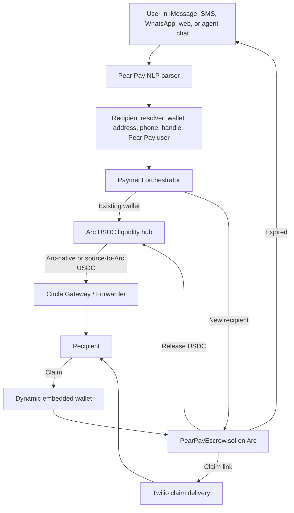

# Pear Pay Arc Bounty Brief

Pear Pay is one app for conversational USDC payments. Users send a message such
as "Pay Alex $20"; Pear Pay resolves the recipient, hides chain choice, routes
USDC through Arc as the liquidity hub, and either settles instantly or creates a
claimable escrow for recipients who are not onboarded yet.

**Live app:** [https://pearpay.app/](https://pearpay.app/)

## Target Bounties

### Best Smart Contracts on Arc with Advanced Stablecoin Logic

`contracts/PearPayEscrow.sol` implements the Smart Escrow System for USDC/EURC:

- Conditional escrow: `escrow()` locks stablecoins against a `claimHash`.
- Multi-step settlement: funds escrow on send and release only on `claim()`.
- Time-based refunds: `refund()` returns expired, unclaimed funds to the sender.
- Sender cancellation: `cancel()` safely unwinds an unclaimed payment.
- Stablecoin flexibility: the token parameter supports Arc USDC and Arc Testnet
  EURC.

Cross-chain conditional transfer architecture:

- Source side: Pear Pay detects the sender source chain and creates a settlement
  plan with `sourceChainId`.
- Arc hub: non-private payments route to Arc Testnet chain `5042002`.
- Destination side: Circle Gateway/Forwarder integration is represented in the
  settlement payload as `source-to-arc` until live Circle credentials are set.

### Best Chain Abstracted USDC Apps Using Arc as a Liquidity Hub

Pear Pay keeps chain selection out of the user experience:

- Users never pick a chain; they only express payment intent.
- The backend selects Arc for non-private USDC settlement by default.
- Instant sends return Arc settlement metadata through the payment API.
- Claimable payments become escrow-on-send, release-on-claim flows.
- Private payments stay shielded while the app still presents one payment
  surface.

## Architecture Diagram

## Circle Developer Tools

- USDC on Arc mainnet/testnet:
  `0x3600000000000000000000000000000000000000`.
- EURC on Arc Testnet:
  `0x89B50855Aa3bE2F677cD6303Cec089B5F319D72a`.
- Circle Gateway / Forwarder: planned live settlement path for moving USDC from
  detected source chains into Arc and then to the destination.
- Circle Wallets: production setup path for hosted or developer-controlled
  wallets where the demo needs managed signing.

The local MVP returns deterministic settlement receipts when `CIRCLE_API_KEY` is
not set. Production Arc settlement intentionally requires Circle credentials,
Arc RPC configuration, and deployed escrow contract addresses.

## Video Demo Script

1. Open Pear Pay and show the hero: one conversation, one payment, no chain
   selector.
2. Use `/pay` or `POST /api/payments` with "Send +12065550100 $12.50 for dinner".
   Show the response: `rail: "arc"`, `route: "source-to-arc"`, Arc destination
   chain `5042002`, and Arc USDC token address.
3. Send "Pay +12065550100 $8" to demonstrate a new recipient. Show Pear Pay
   creating a claimable payment and delivering a Twilio claim link.
4. Explain the smart contract lifecycle: `escrow()` on send, `claim()` on
   recipient onboarding, `refund()` after expiry, `cancel()` before claim.
5. Show Foundry tests for `PearPayEscrow.sol`, covering claim, wrong secret,
   refund, cancel, double-claim rejection, and non-sender cancellation.
6. Show the environment setup: Circle API key, Arc RPC URL, USDC/EURC addresses,
   Arc escrow contract address, and optional Circle Wallets configuration.
7. Close with the user experience: Pear Pay hides cross-chain complexity while
   Arc acts as the USDC settlement and liquidity hub.

## External Setup Before Live Judging

- Deploy `PearPayEscrow.sol` to Arc and set `ARC_ESCROW_CONTRACT_ADDRESS`.
- Set `CIRCLE_API_KEY` and validate the Circle Gateway/Forwarder request shape
  against the final Circle environment.
- Fund the sender/deployer wallet with Arc testnet gas and Arc USDC.
- Configure durable `ESCROW_DATABASE_URL` for production claimable payments.
- Configure Twilio, Dynamic, and WebAuthn production credentials for the full
  end-to-end demo.
