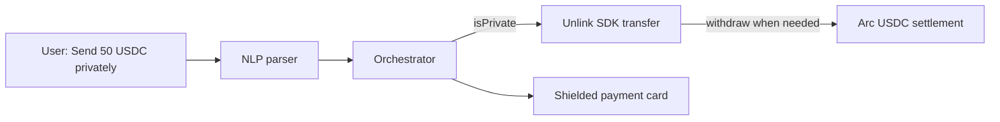

# Unlink Bounty Brief — Private Payments for Pear Pay

Pear Pay adds **optional private mode**: users say *"Send Sarah 50 USDC privately"* and the orchestrator routes through Unlink's `deposit` / `transfer` / `withdraw` primitives so **balances, amounts, and counterparties stay hidden** on-chain.

**Live app:** [https://pearpay.app/](https://pearpay.app/) · **Prize tab:** [https://pearpay.app/prizes](https://pearpay.app/prizes) → Unlink

---

## Target bounties

| Bounty | Prize | What judges look for |
|--------|-------|----------------------|
| **Best Private Nano Payment App** (joint w/ Dynamic + Arc) | 1st $2,000 · 2nd $1,000 | Dynamic wallets + Unlink private routing + Arc settlement |
| **Best Unlink Integration into a Major Open-Source App** | $2,500 | Real app flows routed through private balances |

**Joint prize requirements:** MVP + architecture diagram + video + public repo. Pear Pay satisfies these via [`docs/Submission.md`](./Submission.md), [`docs/ARC_BOUNTY.md`](./ARC_BOUNTY.md), and this doc.

---

## How we implemented it

### Env configuration (`.env` / Vercel)

Unlink activates when **all three** runtime vars are set. Pear Pay reads them from `src/lib/env.ts`:

| Variable | Source | Used by code? |
|----------|--------|---------------|
| `UNLINK_API_KEY` | [dashboard.unlink.xyz](https://dashboard.unlink.xyz) → project → **API Keys** → Create key | ✅ Yes — passed to `createUnlink({ apiKey })` |
| `UNLINK_ENGINE_URL` | Fixed hosted URL for Arc Testnet (not per-project) | ✅ Yes — passed to `createUnlink({ engineUrl })` |
| `UNLINK_ACCOUNT_MNEMONIC` | **You generate** — `cast wallet new-mnemonic` (12/24 words) | ✅ Yes — `unlinkAccount.fromMnemonic()` |
| `UNLINK_ENVIRONMENT` | Set to `arc-testnet` (matches project chain) | ✅ Default in env schema; documents intent |
| `UNLINK_PROJECT_ID` | Dashboard project UUID | ⚠️ Reference only — not read by SDK wrapper today |

Example shape (replace with your own secrets — **never commit**):

```bash
UNLINK_API_KEY=<from dashboard API Keys — shown once at creation>
UNLINK_ENGINE_URL=https://arc-testnet-production-api.unlink.xyz
UNLINK_PROJECT_ID=<UUID from dashboard project settings>
UNLINK_ACCOUNT_MNEMONIC="<12 or 24 words from cast wallet new-mnemonic>"
UNLINK_ENVIRONMENT=arc-testnet
```

**Common mistake:** `cast wallet new` creates an EVM **private key**, not a mnemonic. Unlink needs a **word phrase** from `cast wallet new-mnemonic`.

### SDK wiring

```ts
// src/integrations/unlink/index.ts
const { createUnlink, unlinkAccount } = await import("@unlink-xyz/sdk");
const account = unlinkAccount.fromMnemonic({ mnemonic: env.UNLINK_ACCOUNT_MNEMONIC });
const client = createUnlink({
  engineUrl: env.UNLINK_ENGINE_URL,
  apiKey: env.UNLINK_API_KEY,
  account,
});
await client.ensureRegistered();
```

Private primitives used:

| Primitive | Function | When |
|-----------|----------|------|
| `deposit()` | Shield public USDC → private balance | Funding the shielded pool |
| `transfer()` | Private hop (amount + recipient hidden) | `"…privately"` payments |
| `withdraw()` | Exit to a fresh public EOA | Break funding link before Arc leg |

### Rail selection

```ts
// src/core/payments/settlement.ts
export function selectRail(input): Rail {
  if (input.isPrivate) return "unlink";
  return "arc";
}
```

NLP sets `isPrivate: true` when the message contains *"privately"* (see `src/core/nlp/parser.ts`).

### API surface

| Endpoint | Purpose |
|----------|---------|
| `POST /api/privacy/shield` | Direct Unlink shield/transfer (returns `mode: "live"` when configured) |
| `POST /api/payments` | Full orchestrator — private messages get `rail: "unlink"` in legs |

---

## Verification script

```bash
npm run verify:unlink
```

This script:

1. Checks `UNLINK_API_KEY`, `UNLINK_ENGINE_URL`, `UNLINK_ACCOUNT_MNEMONIC`
2. Warns if mnemonic looks like a hex private key instead of words
3. Runs `tests/unlink.test.ts`
4. Registers the real SDK client against the Arc Testnet engine
5. Optionally curls `POST /api/privacy/shield` if the dev server is running

---

## Live judging demo script

**Duration:** ~90 seconds · **Say the bounty name out loud.**

### 1. Show private mode in the Simulator (~30s)

1. Open [https://pearpay.app/messages](https://pearpay.app/messages) (or `/messages` locally).
2. Pick **iMessage** (or any channel).
3. Type: **`Send Sasha 50 USDC privately`**
4. Point out:
   - 🕶️ **Unlink · shielded** badge on the payment card
   - Amount/recipient masked in-thread
   - Orchestrator selected `rail: "unlink"` (Network tab → `POST /api/payments` response)

### 2. Show the backend shield endpoint (~20s)

With dev server running and Unlink env set:

```bash
curl -s -X POST http://localhost:3000/api/privacy/shield \
  -H 'content-type: application/json' \
  -d '{"amount":50,"recipient":"+15555550123","intent_id":"judge-demo-1"}'
```

Expected live response:

```json
{
  "status": "shielded",
  "note_id": "<opaque tx id>",
  "intent_id": "judge-demo-1",
  "mode": "live",
  "estimated_seconds": 3
}
```

If Unlink env is missing, `mode` is `"stub"` — tell judges you've configured live keys on production.

### 3. Explain what's private (~20s)

| Public (no Unlink) | Private (Unlink rail) |
|--------------------|------------------------|
| Sender ↔ recipient link on-chain | **Hidden** via shielded pool |
| Transfer amount visible | **Hidden** |
| Balance movements traceable | **Hidden** |

Arc still handles the public settlement leg when the flow exits the shielded pool.

### 4. Joint nanopayments hook (~20s)

> *"For the joint Dynamic + Unlink + Arc prize: Dynamic creates the user wallet, Unlink breaks the on-chain link with a private transfer, and Arc settles USDC — ideal for private AI inference micropayments."*

Show [`docs/unlink-integration.md`](./unlink-integration.md) architecture or the `/prizes` Unlink tab.

---

## Architecture (private path)



---

## Code map for judges

| File | Role |
|------|------|
| [`src/integrations/unlink/index.ts`](../src/integrations/unlink/index.ts) | SDK wrapper — `deposit` / `privateTransfer` / `withdraw` |
| [`src/core/payments/settlement.ts`](../src/core/payments/settlement.ts) | `selectRail()` → `"unlink"` when private |
| [`app/api/privacy/shield/route.ts`](../app/api/privacy/shield/route.ts) | `POST /api/privacy/shield` |
| [`app/api/payments/route.ts`](../app/api/payments/route.ts) | Channel-agnostic payment orchestrator |
| [`tests/unlink.test.ts`](../tests/unlink.test.ts) | Stub-mode rail tests (CI-safe) |
| [`docs/unlink-integration.md`](./unlink-integration.md) | Full integration reference |

GitHub links for the submission form:

```
https://github.com/mollybeach/pearpay/blob/main/src/integrations/unlink/index.ts#L57-L74
https://github.com/mollybeach/pearpay/blob/main/src/core/payments/settlement.ts#L22-L26
https://github.com/mollybeach/pearpay/blob/main/app/api/privacy/shield/route.ts
```

---

## Pre-judging checklist

- [ ] Unlink dashboard project created on **Arc Testnet** (not Base Sepolia)
- [ ] `UNLINK_API_KEY` copied from API Keys page
- [ ] `UNLINK_ENGINE_URL=https://arc-testnet-production-api.unlink.xyz`
- [ ] `UNLINK_ACCOUNT_MNEMONIC` from `cast wallet new-mnemonic` (fresh seed)
- [ ] Same vars on Vercel Production for [pearpay.app](https://pearpay.app)
- [ ] `npm run verify:unlink` passes
- [ ] `POST /api/privacy/shield` returns `"mode": "live"`
- [ ] Simulator shows 🕶️ shielded card for private messages

---

## Sponsor feedback (for form)

Unlink's privacy primitives fit naturally as a "private mode" toggle on conversational payments. Local stub mode made hackathon development fast. For production, clearer docs on private-balance ↔ Arc USDC settlement timing would help.
